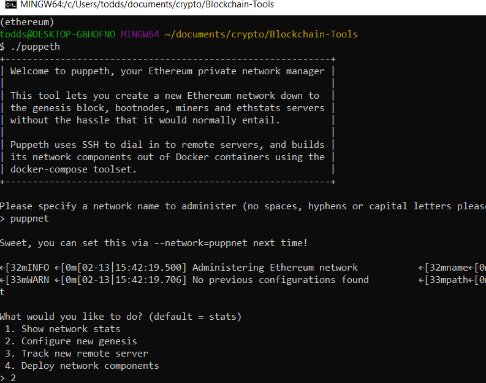
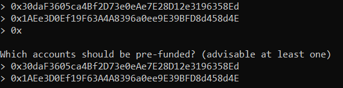

# Setting Up A Local Blockchain Using Python

### Preparation
Ensure you have downloaded and installed all required dependencies including:
* MyCrypto from https://download.mycrypto.com/
* Go Ethereum Tools from https://geth.ethereum.org/downloads/

Also ensure you have an ethereum development environment set up in Python v3.7 or higher using Anaconda

### Creating a Genesis Block
Open Git Bash, and navigate to the location of your Go Tools using _cd_ commands.  I have named my folder "Blockchain-Tools".  List files if desired using _ls_ or _ls -la_ commands.

Using the Puppeth tool, we will create a Genesis block.  Enter _./puppeth_ into the command line and hit _Enter_.
Select a name for your network.  Something like "puppernet" or "puppnet" is fine for the purposes of this tutorial.  Hit _Enter_ again, and the configuration options will appear.

Select _2 (Configure new genesis), Enter_
Select _1 (Create new genesis from scratch), Enter_
Select _2 (Clique - proof-of-authority), Enter_
Select _15 (How many seconds), Enter_ or accept the default and hit _Enter

When you are asked for "Sealed Addresses", select two addresses from your MyCrypto wallet (or another wallet).
Ensure you have the private key and mnemonic for these addresses somewhere safe, as you will need them later.
Copy and paste the first without the "0x" prefix, hit _Enter_, then repeat for the second address, hit _Enter_.
For "which accounts should be pre-funded?", repeat the process above.
Hit _Enter_ one more time to move to the next configuration step.

Enter _yes, Enter_ when asked if addresses should be pre-funded with 1 wei.

Lastly, select a chain/network ID - this can be virtually any number, or accept the default as a random number.
Remember this number for later.
Hit _Enter_, and you should see "Configured new genesis block".

Select _2 (Manage existing genesis)_, and hit _Enter_
Select _2 (Export genesis configurations)_, and hit _Enter_
Hit _Enter_ to accept the default.  
<networkname>.json and <networkname>-harmony.json should have been created.

You may delete the harmony.json file using _rm <networkname>-harmony.json_
  
  

### Creating and Initializing the Nodes
We will use 2 nodes in our example.  In reality there would be dozens, or hundreds of nodes in use.

To create the first node, use the command _./geth account new --datadir node1_
This will create the directory and all required files for the node to run properly
It will ask you for a password.  Enter a password, hit _Enter_, Enter the password again, hit _Enter_
DO NOT forget this password or you won't be able to unlock the node.
Also ensure you write down the public key and keystore path/file as you will need them later.

Repeat the exact same process above, but change _node1_ to _node2_.
You may hit _up_ on your keyboard to save time re-typing the command.

To Initialize node1, enter the command _./geth init <networkname>.json --datadir node1_, then _Enter_

Repeat the process for node2, changing _node1_ to node2_

To run the nodes, first start node1 by entering _./geth --datadir node1 --mine --minerthreads 1_, then _Enter_
The mine flag starts the mining process, and setting the thread to 1 minimizes the computing power used by the process.
Ensure you keep a copy of the "Enode" address highlighted below, as you will need to enter it when running node2.

Node2 is run differently.  You will use the following command:
_./geth --datadir node2 --port 30304 --rpc --bootnodes "<enter enode path>" -ipcdisable_ , _Enter_
It must use a different port than node1, have remote program call enabled, connect to node 1, and most importantly, keep it as a test network.  This is what the flags in the command configure.
  

Your screen should look similar to the below screen shot.

Your blockchain is now running.  

### MyCrypto

Open MyCrypto, and select 2 addresses using your mnemonic or private key.
Create a custom node by navigating to Change Network => Scroll Down => Add Custom Node
Configure according to the screen shot below.  Ensure you select "Custom" for the network, enter your Chain ID or leave blank, and use "http" instead of "https" as it's a local test network.  

Select this network from the list.  Note I have several set up, but yours should show in the list as you created it.

Under "View and Send" paste in another address from your wallet in the "To Address" field, select an amount,
and click _Send_.
Note the unit of measure. 1 ETH is significantly more than 1 wei.  Do not try to send more than you have available (plus the gas/transaction cost).

After clicking _Send_, you should see a confirmation screen.  Review, then click _Send_.

If it worked correctly, you should see "Check Tx" at the bottom.  Click this to view the transaction details.

You may now send transactions between any addresses and wallets on the blockchain using MyCrypto.
Note: Much of this can also be accomplished using Ganache!

